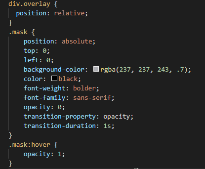

# Updated-Portfolio

# UC Berkeley Fullstack Coding Bootcamp

This porfolio shows activities, homework and project for UC Berkeley Coding Boot Camp. It is a work in progress that I will continue to update. I plan to add social media links and more styling. Also to get scrollTop method to work.

## Code snipit 
This particular code is how I used ccs with my html to do an overlay on my portfolio page.

## Currently working with:
- Html
- CSS
- JavaScript
- jQuery
- GitBash
- GitLab
- GitHub
- Timers
- API
- Firebase

## Assignments (works in progress):

- [Profile](https://github.com/Mamitin/Basic-portfolio/blob/master/portfolio.html)
- [Portfolio](https://github.com/Mamitin/Basic-portfolio/blob/master/portfolio.html)
- [Contact](https://github.com/Mamitin/Basic-portfolio/blob/master/contact.html)
- [Wireframe](https://github.com/Mamitin/HW-Wireframe/blob/master/index.html)
- [Bootstrap Portfolio](https://github.com/Mamitin/Bootstrap-Portfolio/blob/master/index.html)
- [Crytal Collector](https://mamitin.github.io/unit-4-game/blob/master/index.html)
- [Simpson Trivia Game](https://github.com/Mamitin/TriviaGame)
- [GifTastic](https://github.com/Mamitin/GifTastic)
- [Train-Scheduler](https://github.com/Mamitin/Train-Scheduler)
- [Project 1 - K.L.M.S](https://mamitin.github.io/travelX/)

## Contributing
Please find me on [Linkedin](https://www.linkedin.com/in/monica-amitin-58635475/).